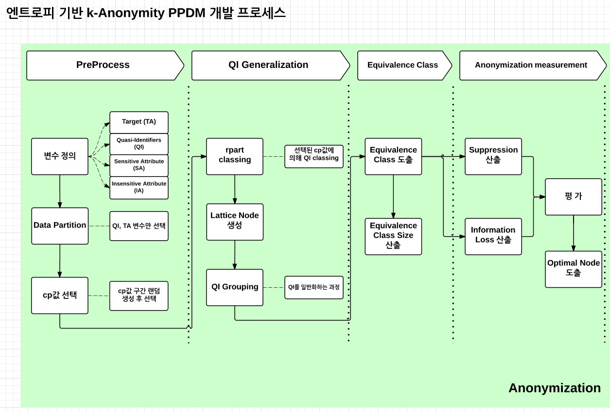

Research for k-Anonymity Privacy Preserving Data Mining based on Entropy
=======

## Contents

*[Process](##Process)

*[Functions](##Functions)

## Process

## Functions

- `parda`
- `cpselec`
- `rpaclass`
- `lanode`
- `qigrp`
- `eclass`
- `resume`
- `plot.resume`
